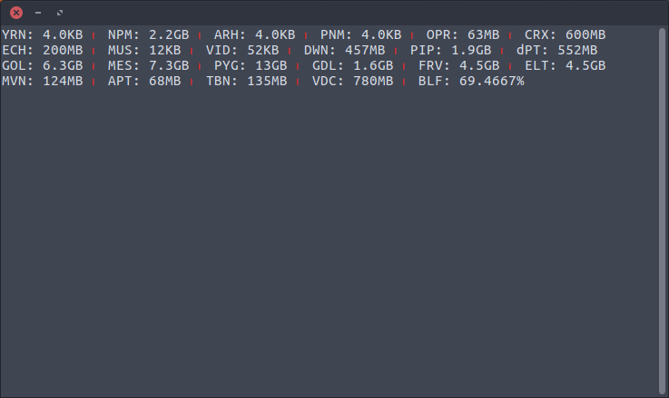
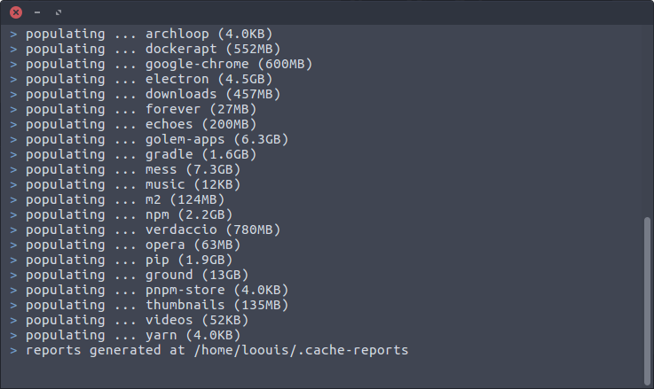

# terminal-cache-report

<p align="left">
  
  
  
  
  
  
  
  
  
  
  
  
</p>

My custom report widget displays in the Terminal that come in very handy so I don't have to check out each application cache directories. Now I am sharing my love.

<p align="left">
  
  
</p>

## __setup

make `cache-update.sh` executable and copy to `/usr/local/bin/` with a new file name,

```bash
$ sudo cp -r cache-update.sh /usr/local/bin/cache-update
$ sudo chmod +x /usr/local/bin/cache-update
```

copy `cache-widget.sh` to your home directory with a new file name,

```bash
$ cp -r cache-widget.sh ~/.cache-widget.sh
```

edit `.bashrc` file,

```bash
$ nano .bashrc
```

and add this line at the end of page, this will displays the widgets each time you open a new Terminal window,

```bash
~/.cache-widget.sh
```

## __configuration

edit both script files that suite to your needs, you and I have different thing to look at.

## __run

to update the directories cache size, suggest to put it in `crontab`,

```bash
$ cache-update
```

Enjoy!

---

[MIT](https://github.com/loouislow81/terminal-cache-report/blob/master/LICENSE)
